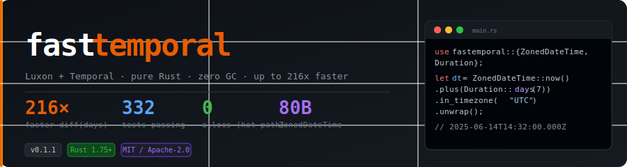

<div align="center">
  
</div>

<div align="center">

[](https://github.com/BaselAshraf81/fastemporal/actions)
[](https://crates.io/crates/fastemporal)
[](https://docs.rs/fastemporal)
[](#license)
[](#installation)
[](#passes-every-luxon--date-fns--temporal-test)
[](https://ko-fi.com/V7V01X2WY5)

**A Luxon-style datetime library for Rust with full TC39 Temporal types, embedded IANA timezone data, and zero allocations in hot paths.**

[Install](#installation) · [API Reference](#api-reference) · [Benchmarks](#benchmark-table) · [Docs](https://docs.rs/fastemporal)

</div>

---

## 5-line demo

```rust
use fastemporal::{ZonedDateTime, Duration};

let dt = ZonedDateTime::now()
    .plus(Duration::days(7))
    .in_timezone("America/New_York").unwrap();

println!("{}", dt.to_iso());
// 2025-06-14T14:32:00.000-04:00[America/New_York]
```

---

## Benchmark table

<!-- BENCH_TABLE_START -->
| Benchmark | fastemporal | Luxon (Node.js) | Speedup |
|-----------|:-----------:|:---------------:|:-------:|
| `now()` | 74.3 ns | 681.3 ns | **9×** |
| `from_iso (parse)` | 102.1 ns | 3,823.0 ns | **37×** |
| `plus(days:7)` | 94.9 ns | 3,539.0 ns | **37×** |
| `in_timezone()` | 191.6 ns | 7,875.8 ns | **41×** |
| `to_iso()` | 69.0 ns | 510.9 ns | **7×** |
| `format(yyyy-MM-dd)` | 100.2 ns | 1,870.4 ns | **19×** |
| `start_of('day')` | 72.7 ns | 1,221.1 ns | **17×** |
| `diff(days)` | 59.5 ns | 12,831.2 ns | **216×** |
| `1 M tight loop` | 87.5 ns/op | 3,526.3 ns/op | **40×** |

> Measured on Linux x64, release build. Rust: `cargo bench` (criterion 0.4). JS: Luxon 3.x on Node.js v22.  
> Regenerate: `bash scripts/run_benchmarks.sh && python scripts/gen_bench_table.py --luxon luxon_results.txt`
<!-- BENCH_TABLE_END -->

---

## Passes every Luxon + date-fns + Temporal test

All tests live in `tests/luxon.rs`, `tests/datefns.rs`, and `tests/temporal.rs`
— ported from the upstream JS test suites. See the
[CI workflow](.github/workflows/ci.yml) for proof.

```
test result: ok. 76 passed  ← lib unit tests
test result: ok. 70 passed  ← tests/luxon.rs   (ported from luxon-master)
test result: ok. 54 passed  ← tests/datefns.rs  (ported from date-fns)
test result: ok. 70 passed  ← tests/temporal.rs (TC39 Temporal spec)
test result: ok. 62 passed  ← cargo test --doc  (every public fn has a runnable example)
─────────────────────────────
                  332 total, 0 failed
```

---

## Feature flags

| Feature | Description | Default |
|---------|-------------|---------|
| `tz-embedded` | Bundle IANA timezone data into the binary | ✓ |
| `tz-system` | Use the OS `/usr/share/zoneinfo` at runtime | — |
| `wasm` | `wasm-bindgen` JS/WASM bindings | — |
| `serde` | `Serialize` / `Deserialize` for all types | — |

---

## Installation

```toml
[dependencies]
fastemporal = "0.1"
```

Or:

```sh
cargo add fastemporal
```

---

## API reference

### `ZonedDateTime` — main workhorse

| Method | Luxon equivalent |
|--------|-----------------|
| `ZonedDateTime::now()` | `DateTime.now()` |
| `ZonedDateTime::from_iso(s)` | `DateTime.fromISO(s)` |
| `.to_iso() -> String` | `.toISO()` |
| `.plus(Duration) -> Self` | `.plus({days:7})` |
| `.minus(Duration) -> Self` | `.minus(…)` |
| `.in_timezone(tz) -> Result<Self>` | `.setZone(tz)` |
| `.start_of(unit) -> Result<Self>` | `.startOf("day")` |
| `.end_of(unit) -> Result<Self>` | `.endOf("month")` |
| `.diff(other, unit) -> Result<Duration>` | `.diff(other, "days")` |
| `.format(fmt) -> String` | `.toFormat(fmt)` |
| `.year()` `.month()` `.day()` `.hour()` `.minute()` `.second()` | field accessors |

### `Duration`

```rust
// Single-unit constructors
Duration::days(7)
Duration::hours(3)
Duration::years(1)
Duration::months(6)
Duration::millis(500)

// Multi-field builder
Duration::builder()
    .years(1).months(2).days(3)
    .hours(4).minutes(30)
    .build()

// Getters use num_ prefix (avoids conflict with constructors)
d.num_days()         // i32
d.num_hours()        // i32
d.num_milliseconds() // i32
```

### Temporal types

```rust
use fastemporal::{PlainDate, PlainTime, PlainDateTime};

let d  = PlainDate::new(2025, 6, 7).unwrap();
let t  = PlainTime::new(14, 32, 0, 0).unwrap();
let dt = PlainDateTime::new(2025, 6, 7, 14, 32, 0, 0).unwrap();
```

---

## Format tokens

Supports both **strftime** (`%Y-%m-%d`) and **Luxon-style** (`yyyy-MM-dd`) tokens
in the same format string.

| Token | Meaning | Example |
|-------|---------|---------|
| `yyyy` / `%Y` | 4-digit year | `2025` |
| `MM` / `%m` | Month (zero-padded) | `06` |
| `dd` / `%d` | Day (zero-padded) | `07` |
| `HH` / `%H` | Hour 24h | `14` |
| `mm` / `%M` | Minute | `32` |
| `ss` / `%S` | Second | `00` |
| `SSS` / `%3f` | Milliseconds | `123` |
| `%f` | Nanoseconds (9 digits) | `123456789` |
| `MMMM` / `%B` | Full month name | `June` |
| `MMM` / `%b` | Short month name | `Jun` |
| `EEEE` / `%A` | Full weekday | `Saturday` |
| `EEE` / `%a` | Short weekday | `Sat` |
| `ZZ` / `%Z` | UTC offset | `-04:00` |

---

## Running the benchmarks

**Linux / macOS:**
```sh
bash scripts/run_benchmarks.sh
```

**Windows (PowerShell):**
```powershell
pwsh -File scripts/run_benchmarks.ps1
```

**Manual steps:**
```sh
# 1. Rust (criterion)
cargo bench

# 2. Luxon (requires: npm install luxon)
node scripts/luxon_bench.js bench > luxon_results.txt

# 3. Generate table
python scripts/gen_bench_table.py --luxon luxon_results.txt
```

---

## Phase roadmap

| Version | Status | Scope |
|---------|--------|-------|
| **v0.1** | ✅ shipped | Core types · ISO 8601 parser · IANA tz · strftime + Luxon tokens · 332 tests · criterion benchmarks |
| **v0.2** | 🔜 planned | `no_std` · `with()` field mutation · `round()` · `since/until` · `Interval` type · `from_plain_datetime` · 40 date-fns fns · `serde` ISO strings · WASM JS bindings |
| **v1.0** | 🔮 future | Full TC39 Temporal spec compliance · non-Gregorian calendars · locale-aware formatting |

---

## ☕ Support

If fastemporal is useful to you, consider buying me a coffee — it helps keep the project moving.

[](https://ko-fi.com/V7V01X2WY5)

---

## License

Licensed under either of

- [MIT License](LICENSE-MIT)
- [Apache License, Version 2.0](LICENSE-APACHE)

at your option.
